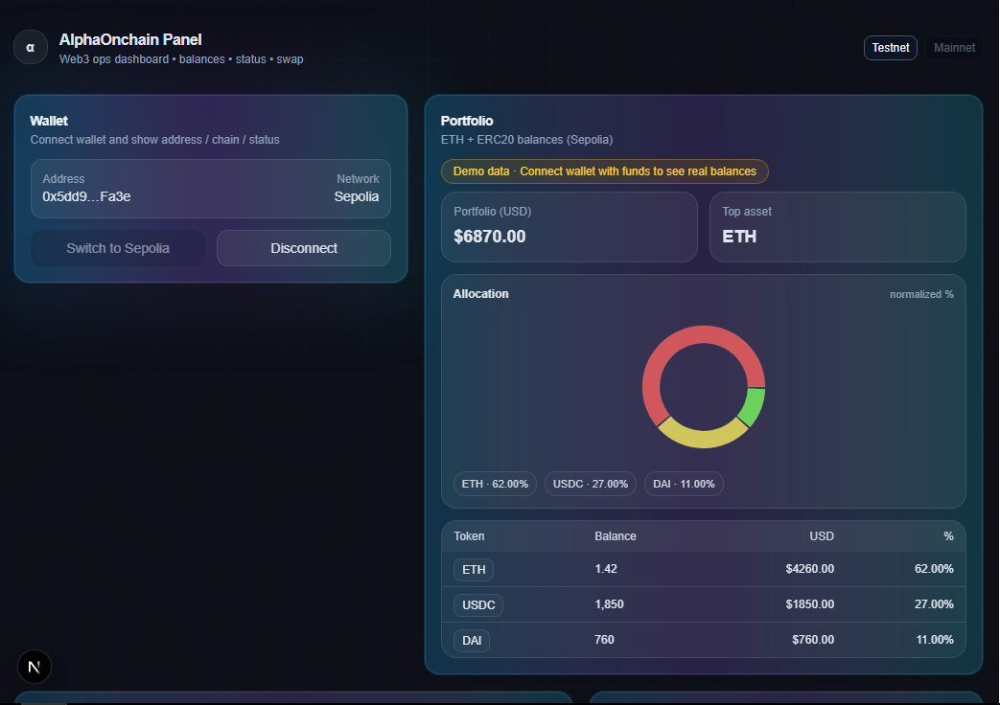
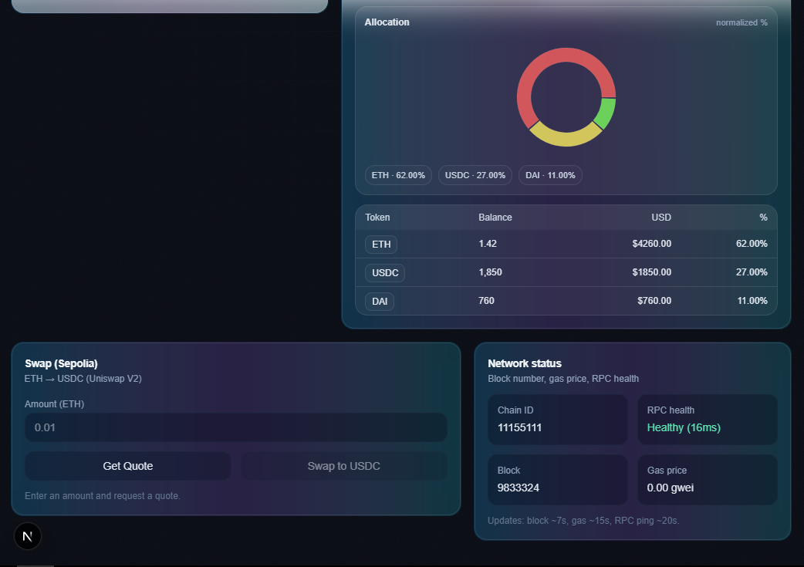

# AlphaOnchain Panel

<p align="center">

A minimal Web3 operations dashboard focused on wallet connectivity, on-chain data, and clean operational UI.

</p>

<p align="center">
 


</p>

---

## Screenshots




---

## Features

- Wallet connection via injected providers (MetaMask-compatible)

- ETH and ERC20 on-chain balance tracking

- Portfolio overview with allocation chart

- Network status monitoring (block number, gas, RPC health)

- ETH → USDC swap on Sepolia testnet

- Automatic demo portfolio when wallet has no funds

- Clear separation between UI, hooks, and Web3 logic

- Unit tests and CI validation

---

## Architecture
src/\
├── components/ # Presentational UI components\
├── hooks/ # Web3 logic and state\
├── lib/ # Static configs and demo data\
├── styles/ # Global styling\
└── app/ # Next.js App Router

Key principles:

- Hooks own Web3 concerns

- Components consume normalized, UI-ready data

- Demo data never mixes with real balances

- Testnet and mainnet behavior is explicit

---

## Tech Stack

- Next.js 15 (App Router)

- TypeScript (strict)

- Wagmi + Viem

- Tailwind CSS

- Recharts

- Vitest

---

## Local Development

```bash

git clone https://github.com/franklinzerocr/alphaonchainpanel.git

cd alphaonchainpanel

npm install

npm run dev
```
Runs at `http://localhost:3000`.

* * * * *

Environment Variables
---------------------

The project runs without secrets by default.

Optional RPC override:
NEXT_PUBLIC_RPC_URL=

